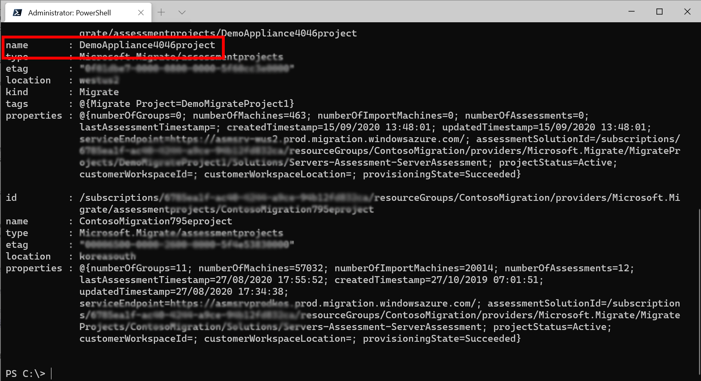
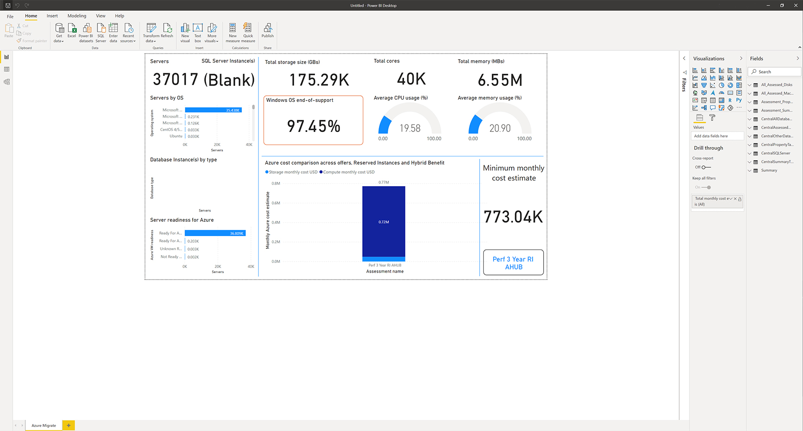

# assessment-utility

1. A **PowerShell module**(AzureMigrateAssessmentCreationUtility.psm1) used to automate the creation of multiple assessments for migration to Azure in Azure Migrate.
2. A **PowerBI template**(Azure Migrate Assessment Comparison PowerBI Template.pbit) to visualize and compare cost estimates of migrating to Azure VMs.

## Overview

[Azure Migrate: Server Assessment](https://docs.microsoft.com/azure/migrate/migrate-services-overview#azure-migrate-server-assessment-tool) is a Microsoft solution used to discover and assesses on-premises VMware VMs, Hyper-V VMs, and physical servers for migration to Azure.

Currently, users use the Azure Portal to [create a group of machines](https://docs.microsoft.com/azure/migrate/how-to-create-a-group#create-a-group-manually), and [create assessments on the group](https://docs.microsoft.com/azure/migrate/how-to-create-assessment). To compare cost estimates in Azure using combinations of sizing criteria, Reserved Instances and Hybrid benefits, users need to create and compare across multiple assessments. This utility helps automate these activities and visualize the cost estimates across multiple assessments.

The documentation on the Network Connections PowerBI template can be found in the [azure-migrate/dependencies-at-scale](https://github.com/Azure/azure-docs-powershell-samples/tree/master/azure-migrate/dependencies-at-scale) section of the azure-docs-powershell-samples GitHub repo.

## How to Use

### Requirements

To use this utility the following are required:

1. **Azure User Account:** The PowerShell script uses the Azure Migrate REST APIs. To authorize the API calls, you need to make sure that you are connected to Azure with a user account that can access your Azure Migrate project.
2. **Azure Migrate Project:** An Azure Migrate project must already have been created.
    - If you are using the Azure Migrate appliance as a discovery source, the appliance should be deployed and successfully collecting data.
    - If you are using the CSV Import as a discovery source, the import should already be successfully done.
3. **PowerShell Version:** It's strongly recommended you install the [latest version of PowerShell](https://docs.microsoft.com/powershell/scripting/install/installing-powershell) available for your operating system.
4. **Azure PowerShell Module:** The script relies on basic [Azure PowerShell](https://docs.microsoft.com/powershell/azure/install-az-ps) functionality to connect to your subscription. It checks for the presence of an up-to-date install of the standard Azure PowerShell module to do this.
> Azure [Cloud Shell](https://docs.microsoft.com/azure/cloud-shell/overview) is a convenient alternative to installing and maintaining the required software on a local machine.
5. **Power BI Desktop:** To use the Power BI template to visualize and compare assessments, you need to download [Power BI Desktop](https://powerbi.microsoft.com/desktop/). To publish the dashboard online, you need an active Power BI subscription and a workspace(destination) to publish. 

### Download the utility

- Go to: <https://github.com/Azure/azure-docs-powershell-samples/tree/master/azure-migrate/assessment-utility>
- Click **Code** and then click **Download ZIP.**
- Extract the contents of the ZIP file to the directory you want to work in.
- Navigate to the folder: \azure-docs-powershell-samples-master\azure-migrate\assessment-utility

### Use the Powershell utility

1. Start a PowerShell terminal, and connect to your Azure account with access to the Azure Migrate project where you wish to create the assessments:

```powershell
Connect-AzAccount
```

2. Navigate to the folder where you extracted the ZIP file and access the module in the assessment-utility folder:
> Please note this module is dependent upon AssessmentCombinations.json and CommonAssessmentProperties.json, so please ensure they are stored in the same folder as the PowerShell script. 
```powershell
Import-Module .\AzureMigrateAssessmentCreationUtility.psm1
```

3. You are all ready to get started.  You might find it easier to start can declare some variables instead of typing the same information, with each step.  The first step is to find the name of your Azure Migrate assessment project name. 

```powershell
# Declare variables
$subscriptionId = "<Your Azure Subscription ID>"
$resourceGroupName = "<The name of the resource group where your Azure Migrate project resides>"

#Query the name of your Azure Migrate project
Get-AzureMigrateAssessmentProject -subscriptionId $subscriptionId -resourceGroupName $resourceGroupName
```
The information returned will look as below, take note of what is returned in the *name* field. 


4. Once you have discovered servers in your Azure Migrate project, type the following cmdlet to create multiple assessments:

```powershell
#Declare Variables
$subscriptionId = "<Your Azure Subscription ID>"
$resourceGroupName = "<The name of the resource group where your Azure Migrate project resides>"
$assessmentProjectName = "<your assessment project name>"
$discoverySource = "<the discovery source you used to discover servers in the project- Appliance or Import>"

New-AssessmentCreation -subscriptionId $subscriptionID -resourceGroupName $resourceGroupName -assessmentProjectName "Enter the information discovered in step 3" -discoverySource "Appliance"

```
> If you are unsure what the subscription ID and resource group values should be, navigate to the Azure portal, browse to your Azure migrate project and click on servers where you can see the project settings by clicking on change next to the project name. To get the Subscription Id, search for Subscriptions in the portal and click on your subscription. You can see the subscription ID and resource group name listed there.

Other cmdlets available in the script:
```powershell
# Create a new Group and all all machines in the project
$group = New-GroupAddMachines -token $token -subscriptionId $subscriptionId -resourceGroupName $resourceGroupName -assessmentProjectName $assessmentProjectName -discoverySource $discoverySource -groupName $groupName

# Get status of an update operation to group
$group = Get-GroupStatus -token $token -subscriptionId $subscriptionId -resourceGroupName $resourceGroupName -assessmentProjectName $assessmentProjectName -groupName $groupName

# Get group details
$group = Get-Group token $token -subscriptionId $subscriptionId -resourceGroupName $resourceGroupName -assessmentProjectName $assessmentProjectName -groupName $groupName

# Export Assessments in local .xlsx files
Export-Assessment -token $token -subscriptionId $subscriptionId -resourceGroupName $resourceGroupName -assessmentProjectName $assessmentProjectName -groupName $group.name -assessmentName $assessmentName

# Get Authentication token
Get-AccessToken
```

### Modify the PowerShell utility
There are two .json files that are used for configuring the PowerShell utility:
- **CommonAssessmentProperties.json**:
 This file has all the common assessment properties that will be used to create the assessments. You can change these to configure the assessment properties.

- **AssessmentCombinations.json**:
 This file has all the assessment properties for which multiple assessments will be created. Currently, it is configured for 12 different combinations of Reserved instances, Azure Hybrid Benefit and Sizing criteria.

### Use the PowerBI template

Before you can use the PowerBI template, please ensure that the assessment reports have been downloaded and follow the following steps:

1. Launch the Power BI template and [import the excel workbooks](https://docs.microsoft.com/power-bi/connect-data/desktop-import-excel-workbooks) created as a result of executing the PowerShell utility script.
**Note**: You must import all the excel files corresponding to all the assessments you would like to compare, one at a time. Additionally, if you would like to see information around the discovered database estate please follow the steps provided [here](https://docs.microsoft.com/azure/migrate/how-to-discover-applications), and download and import the application inventory information as well.

2. Only after all the desired Excel workbooks files have been imported, click on the refresh button to render the charts. This may take upto 30-45 minutes depending upon the size of the data 
**Note**: Power BI may throw an error if you refresh after importing a subset of Excel workbooks. You may have to reopen the template and import all the workbooks again.
3. Select "Save as" option from the File menu and save the file after .pbix format
4. Publish the dashboard following the steps [here](https://docs.microsoft.com/power-bi/create-reports/desktop-upload-desktop-files)

> Below is a sample output of the data within PowerBI



### Modify the PowerBI template

We would recommend not making any changes to the existing PowerBI template. 


## Known Issues / Troubleshooting

### PowerShell utility
- **Token expiry:** If you receive issues related to token expiry, run the Connect-AzAccount command to log in to Azure again or run the Get-AccessToken command to get a fresh token.
- **Assessment properties dependencies:** If you receive invalid parameters because of Assessment properties, please ensure that you are using the valid combinations as in the Azure portal.
- **Time taken by New-Group-Add-Machines function:** This function might take a little longer at times if you are running it on a project with more than 10,000 machines.
- **Method Not Allowed:** If you are getting an error with Status code 405 while creating an assessment, please check the status on the portal for these assessments. You can get this when you are trying to call the assessment creation function and the status of a pre-existing assessment with the same name is not Ready. Please wait till the assessment status is ready before calling the New-AssessmentCreation function.
- **Assessment Export failing:** First, please check the status on the portal for these assessments. If the export is being attempted when the assessment is not ready, the export function might not work as expected. Please wait till the assessment status is ready before calling the Export-Assessment function.

