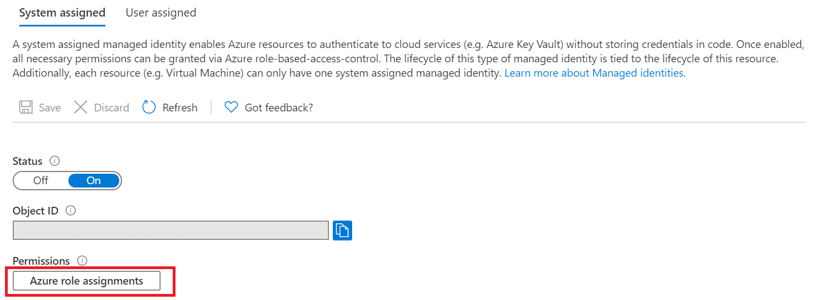
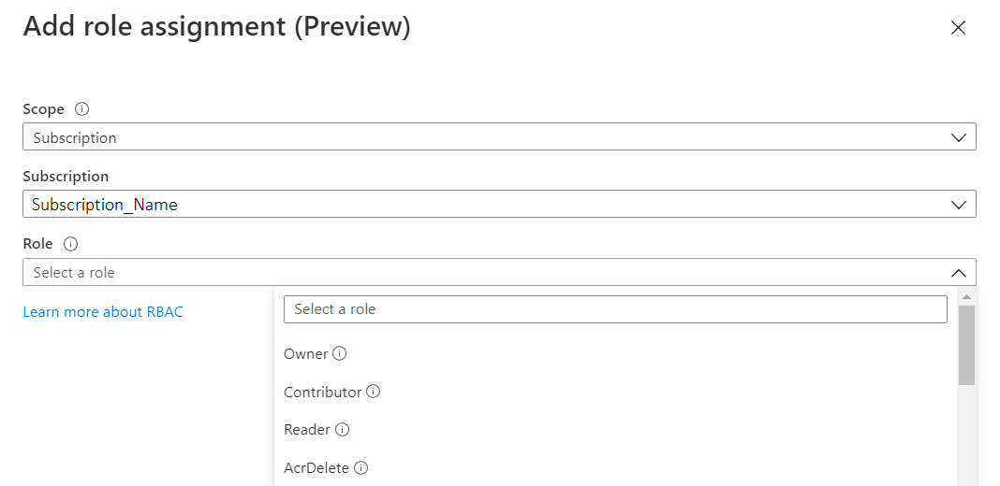
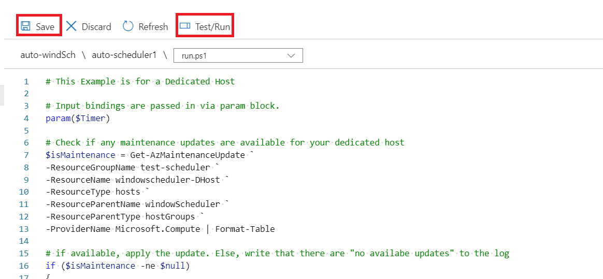

# Scheduling Maintenance Updates with Maintenance Control and Azure Functions

## Automating Maintenance Control Events

Azure recently launched the [Maintenance Control](https://docs.microsoft.com/azure/virtual-machines/maintenance-control) feature which allows customers to imperatively apply platform maintenance to Azure Dedicated Hosts and isolated VMs. You may require a way to automatically check for updates and apply them according to a defined schedule. You can do this serverlessly using Azure Functions and PowerShell.

## Setting up The Function 

We will be implementing this using a Timer Triggered Azure Function. Remember that the Maintenance Control feature is only available to Dedicated Hosts and Isolated VMs. This function is only executable after you have [assigned a configuration](https://docs.microsoft.com/azure/virtual-machines/maintenance-control-powershell#assign-the-configuration) to your resource. Follow these steps to create your automatic maintenance control Function:

1. Create a new [Functions App](https://docs.microsoft.com/azure/azure-functions/functions-create-scheduled-function) on the Azure portal. (_Note: This example is uses a **PowerShell core** runtime stack and the Azure Shell only supports it on Windows. If you would like to run the function on a Linux Operating System pick a different runtime stack_).

1. Navigate to your new functions app and create a [Timer Triggered](https://docs.microsoft.com/azure/azure-functions/functions-create-scheduled-function#create-a-timer-triggered-function) function. Use the [cron scheduler](https://docs.microsoft.com/azure/azure-functions/functions-bindings-timer?tabs=csharp#ncrontab-expressions) to pick a preferred time for your function to run. You can also [update your schedule](https://docs.microsoft.com/azure/azure-functions/functions-create-scheduled-function#update-the-timer-schedule) on the Azure Portal as required.

1. After you have created your function, you will need a method to login your app and access other resources on the portal. The recommended method is to make your App a [System Assigned](https://docs.microsoft.com/azure/app-service/overview-managed-identity?tabs=dotnet) Managed Identity and assigning it a role with appropriate permissions. To assign a role:

   * Click **Azure Role Assignments** within the **System Assigned** tab:
     

   * Then **Add Role Assignment**.

   * Select **Subscription** as scope and set role to contributor:
     

1. Now navigate to the **run.ps1 file.** This is where your function will live. Use [Get-AzMaintenanceUpdate](https://docs.microsoft.com/azure/virtual-machines/maintenance-control-powershell#check-for-pending-updates) check if your Isolated VM or Dedicated Host has any scheduled updates.

1. If updates are available, apply them using [New-AzApplyUpdate](https://docs.microsoft.com/en-us/azure/virtual-machines/maintenance-control-powershell#apply-updates).

1. **Save** and **Run** your function. It will now automatically apply available updates to your resource each time the timer is triggered. 
